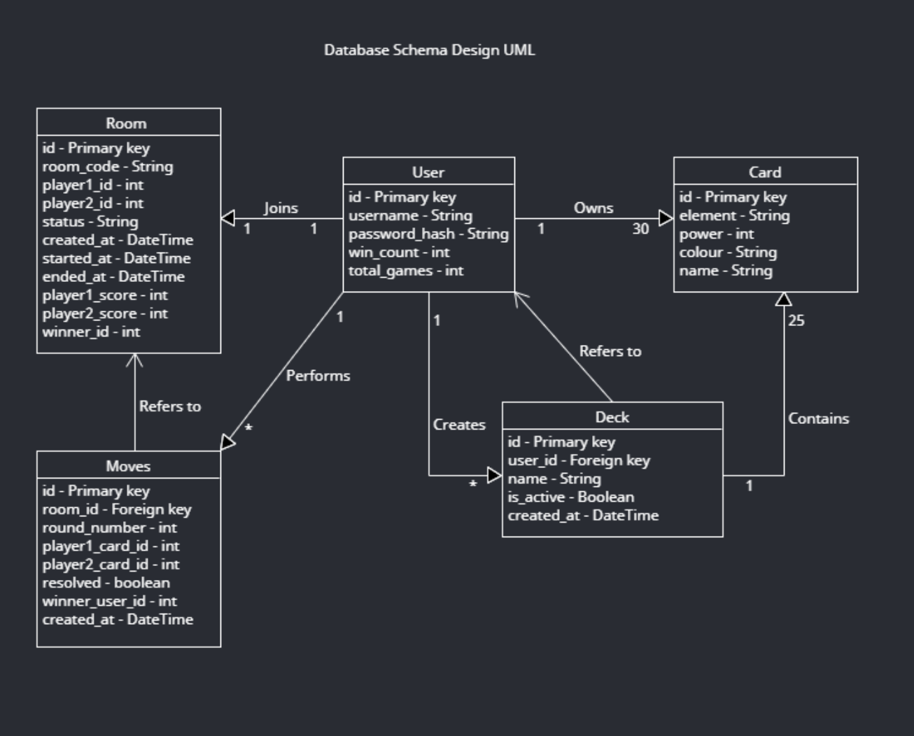
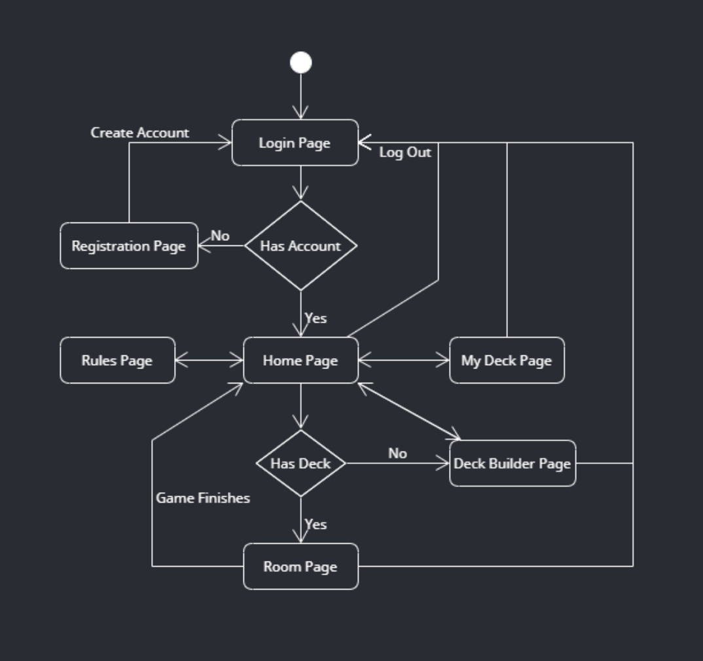

# Card-Jitsu Web App
Advance Web Dev project, Card-Jitsu simulator

## What is Card-Jitsu?
<p>Card-Jitsu is a simple but strategic card game from Club Penguin.<br>Players battle using cards based on three elements</p>
<ul><li>Fire<li>Grass<li>Snow</ul>
Each card also has a power number (1-12), and a color

### Rules Summary
<ol>
    <li>Elements follow rock-paper-scissors logic
    <ul>
        <li>Fire beats Grass
        <li>Grass beats Water
        <li>Water beats Fire
    </ul>
    <li>If both cards are the same element, the higher power number wins
    <li>Players reveal cards simultaneously
    <li>Games proceed through multiple rounds
    <li>A match ends when one player gets either
    <ul>
        <li>A player wins a round with each type of element
        <li>A player wins 3 rounds with different colors of the same element
    </ul>
</ol>

## Projecy Overview
<p>This application recreates the Card-jitsu experience as a full-stack web app using:</p>
<ul>
    <li>Python Flask for backend and API
    <li>SQLAlchemy ORM 
    <li>JWT Authentication for a secure login
    <li>Some External API
    <li>HTML forms for a simple UI
</ul>

## System Architecture
The Style is Monolithic

### UML Diagrams

#### UML Class Diagram



#### UML Activity Diagram




## How the website works

### Registration

- User enters username, email, password
- Password is hased before storage
- System
    - creates a User
    - assigns 15 random cards (UserCard rows)
    - creates an empty Deck

### Login

- User logs in with username + password
- Backend verifies the hash
- Backend returns a JWT token for authenticated requests

### Viewing Cards

Endpoint: GET api/user/cards

- User sees their 30 assigned cards

### Creating/Editing a Deck

- User selects 25 of their 30 cards
- Simple interface
- Each card displayed with:
    - element
    - power
    - colour
    - "Select"/"Deselect" button
- Backend validates:
    - exactly 25 cards
    - all belong to the user
- Then updates DeckCard rows

### Joining a Room

User enters a room code

Player 1 creates room <br>
<strong>POST api/rooms</strong><br><br>
Player 2 joins room <br>
<strong>POST api/rooms/join</strong><br><br>
Room moves to active status

### Playing the Match

Each Round:<br>
1. Both Players send <strong>POST api/rooms/\<room\>/play{"card_id":123}</strong>
2. When boths moves are in:
    - Backend compares element & power
    - Determines winner using the rules from above
    - Stores the round in Move
3. Scores update
4. When match ends:
    - Room.winner_id filled
    - Status becomes finished


## Data Models

### User

| Attribute     | Type  | Description       |
| :---:         | :---: | :---:             |
| id            | int   | Primary Key       |
| username      | str   | Unique username   |
|password_hash  | str   | Hashed password   |

Relationships:<br>
<ul>
    <li>decks, the users decks
    <li>user_cards, the 15 base cards assigned at registration
    <li>rooms_as_p1, rooms_as_p2, rooms they are participating in
</ul>

### Card

| Attribute     | Type  | Description       |
| :---:         | :---: | :---:             |
|id|int|Primary Key|
|element|str|"fire","water","grass"|
|power|int|1-12|
|colour|str|"red", "blue", "yellow", "green", "purple", "orange"|
|name|str|"fire 12 blue"|

These cards form the global card pool. User recieve 15 random ones

### UserCard

| Attribute     | Type  |
| :---:         | :---: |
|id|int|
|user_id|Foreign Key -> User|
|card_id|Foreign Key -> Card|

This determines which card a user can place in a deck

### Deck

| Attribute     | Type  |
| :---:         | :---: |
|id|int|
|user_id|Foreign Key -> User|
|name|str|
|is_active|bool|
|created_at| DateTime|

A deck of exactly 10 chosen cards

### DeckCard

| Attribute     | Type  |
| :---:         | :---: |
|id|int|
|deck_id|Foreign Key -> Deck|
|card_id|Foreign Key -> Card|

### Room

| Attribute     | Type  | Description       |
| :---:         | :---: | :---:             |
|id|int|Primary Key|
|room_code|str|Code users enter to join|
|player1_id|Foreign Key -> User | First Player|
|player2_id|Foreign Key -> User | Second Player|
|status|str|"waiting","active", "finished"|
|winner_id|Foreign Key -> User | Winner of match|

### Move

| Attribute     | Type  |
| :---:         | :---: |
|id| int|
|room_id|Foreign Key -> Room|
|round_number|int|
|player1_card_id|Foreign Key -> Card|
|player2_card_id|Foreign Key -> Card|
|resolved|bool|
|winner_user_id|Foreign Key -> User|


## Testing & QA

Our testing strategy combines unit test, integration tests, and end to end tests to verify core functionality. We used pytest for automated backend testinf and Selenium for browser bases end to end testinf. The goal was not exhaustive coverage, but to ensure that critical features (game rules, authentication, and user stats) behave correctly.

### Unit test (pytest)

In the file ```test_game_logic.py``` we have 3 unit tests
- test_compare_cards_fire_beats_grass: this ensures that the elemental rules correctly give fire a win over grass when power is equal or advantage applies
- test_compate_cards_grass_beats_water: this is similar to the last one but with grass and water
- test_has_club_penguin_win_three_same_element_diff_colours: checks that the win condition is triggered when a player has three cards of the same element with three different colours.

### Integration test (pytest)

In the file ```test_api_flow.py``` we have 1 integration test<br>
It calls ```/api/register``` and registers a user, then calls ```/api/login``` to login with that same user and obtains a JWT, uses the token to access ```/api/me```, and then confirms the ```win_count``` and ```total_games``` are changed correctly.

### How to Run

```powershell
python -m pytest
```

### Selenium End to End Test

The Selenium test is in the file ```test_login_flow.py``` .<br>
```run_login_flow```: 
- Opens the real ```/login``` page in a browser
- Enter credentials for the user that was already created in that browser
- Submits the form and waits for the redirect
- Verifies that the page title corresponds to the home page and that the main heading and the button are visible.
- This validates the full path from frontend form -> ```/api/login``` -> homepage UI.

The app must already be running and you must register the user 'Aradtesting' with the password 'test'

```powershell
#Terminal 1
python app.py

#Terminal 2
python selenium_tests/test_login_flow.py
```

### How to run all tests
```powershell
# Run unit + Integration tests
python -m pytest

# Run Selenium End to End tests (with app running)
python selenium_tests/test_login_flow.py
```

## Deployment & DevOps

### Docker Containerization

This project is fully containerized using Docker to ensure consistent execution across different environments

#### Step 1 Build the image:
```powershell
docker build -t cardjitsu .
```
#### Step 2 Run the container:
```powershell
docker run -p 5000:5000 cardjitsu
```
#### Step 3 Once running, the app can be accessed at:

WIP

### Why Docker?
Containerization solves:
- "Works on my machine" problems
- OS & dependency inconsistencies
- Environment replication fro testing and deployment

This application runs inside a stable Python 3.12-slim container regardless of the host system.

### CI/CD Pipeline (GitHub Actions)

This project uses a GitHub Actions CI workflow that runs automatically on every push or pull request to ```main```.


The Workflow performs the following steps
- Installs dependencies
- Runs linting
- Executes autmated pytest unit & integration tests
- Ensures that the build remains stable before merging

If tests fail, GitHub prevents merging changes into the main branch

### Production Deployment

This application is designed to be deployed on a Linux server using Docker

#### Deployment Steps:
```powershell
git pull
docker build -t cardjitsu .
docker stop cardjitsu || true
docker rm cardjitsu || true
docker run -d --name cardjitsu -p 80:5000 cardjitsu
```

### Summary of DevOps Workflow

1. Developer pushes code to GitHub
2. CI pipeline runs tests
3. If all tests pass -> merge to main
4. Server pulls latest code
5. Docker rebuilds & restarts container
6. Updated app goes live

This ensures safe deployments, predictable environments, repeatable builds, and confident iteration velocity
